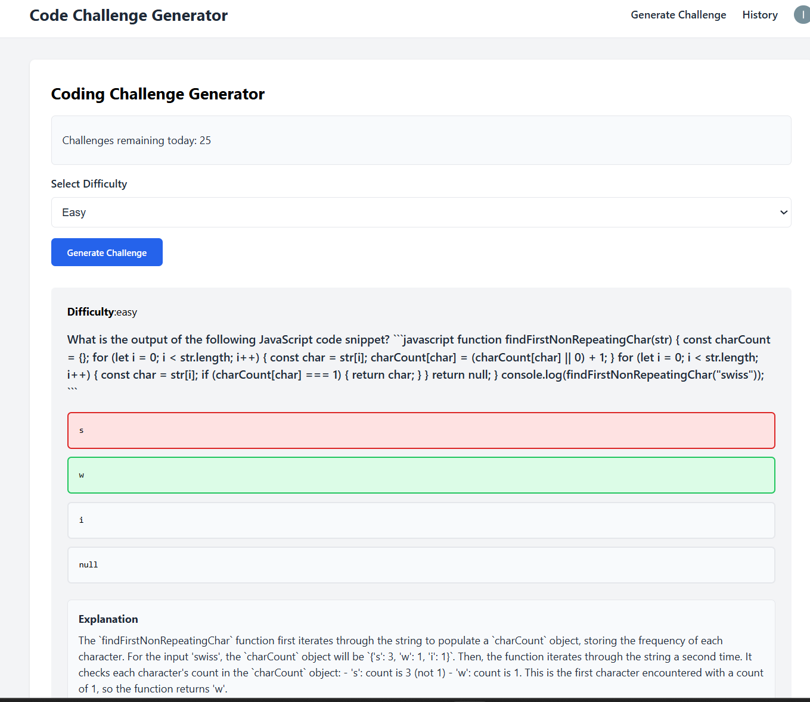

# 🔥 GenAI Coding Challenge Generator

A full-stack web application that lets users generate and practice coding challenges of varying difficulties — powered by FastAPI, React, and integrated with GenAI (e.g., Gemini or GPT) to dynamically create questions. Authentication is handled via [Clerk.dev](https://clerk.dev) for secure access and user management.

---

## 🚀 Features

- ✨ **AI-generated coding challenges** (Easy/Medium/Hard)
- 🔒 **Authentication** with Clerk (Google sign-in and more)
- 📜 **Challenge history tracking**
- 🔄 **Daily challenge quota with reset**
- 📦 FastAPI (Python), React (Vite), and Clerk
- 📁 Modular frontend and backend architecture

---

## 🛠 Tech Stack

**Frontend:**
- React (with Vite)
- React Router DOM
- Clerk React SDK

**Backend:**
- FastAPI
- SQLAlchemy (with SQLite or PostgreSQL)
- Clerk Python SDK
- OpenAI (or Gemini) for AI prompt generation
- Uvicorn

**Tooling:**
- `uv` for Python environment and dependency management
- Node.js/NPM

---

## 📸 Demo

> Users can select a difficulty, generate a challenge, view an explanation, and track their history. Authenticated users have limited daily usage, with a reset period every 24 hours.



---

## 📂 Project Structure

```
project-root/
├── backend/
│   └── src/
│       ├── routes/
│       ├── database/
│       ├── app.py
│       ├── utils.py
│       ├── ai_generator.py
│       └── .env
├── frontend/
│   └── src/
│       ├── auth/
│       ├── challenge/
│       ├── history/
│       ├── layout/
│       ├── utils/
│       ├── App.jsx
│       ├── main.jsx
│       └── .env
```

---

## 🔐 Authentication with Clerk

- Integrated via Clerk's React and Python SDKs.
- Supports Google login (custom providers can be added via Clerk dashboard).
- Tokens are validated on the backend before challenge generation or history access.

---

## 🤖 GenAI Integration

The backend sends user prompts to a GenAI model (like Gemini or OpenAI GPT) and formats the returned data into multiple-choice questions with explanations.

---

## 📈 How It Works

1. **Frontend**: User signs in and selects a difficulty.
2. **Token Handling**: Clerk issues an auth token on sign-in.
3. **Backend**: Token is verified, and the AI model is called to generate a challenge.
4. **Database**: Challenge is stored and linked to the user.
5. **Quota System**: Users are allowed a limited number of challenges per 24 hours.

---

## 🔧 Setup Instructions

### Backend (FastAPI)
```bash
cd backend
uv init .
uv add fastapi uvicorn sqlalchemy python-dotenv openai clerk-sdk
uv run src/server.py
```

> Make sure `.env` contains your `CLERK_SECRET_KEY` and GenAI API key.

---

### Frontend (React + Clerk)
```bash
cd frontend
npm install
npm install react-router-dom@6 @clerk/clerk-react
npm run dev
```

> Make sure `.env` includes:
```
VITE_CLERK_PUBLISHABLE_KEY=your_clerk_publishable_key
```

---

## 📌 Notes

- Use `uv` to avoid Python environment issues (it handles virtualenvs and dependencies cleanly).
- UI styling is handled via pre-written CSS files found in the GitHub repo.
- React Router manages navigation between components like `/`, `/history`, `/sign-in`, and `/sign-up`.

---

## 💡 Extending the Project

- Add a leaderboard or gamified elements
- Support other types of questions (e.g., fill-in-the-blank)
- Integrate other LLMs (Claude, Mistral, etc.)
- Monetize access using Stripe and webhook callbacks

---

